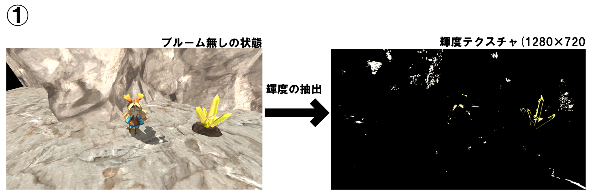
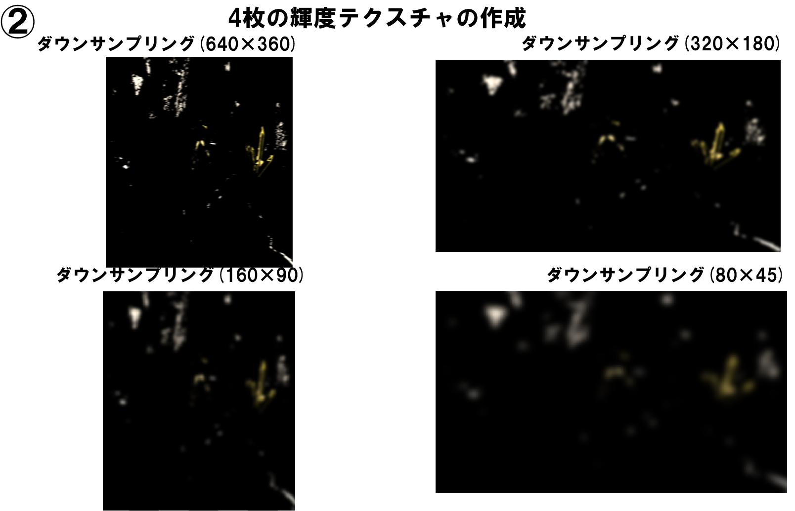
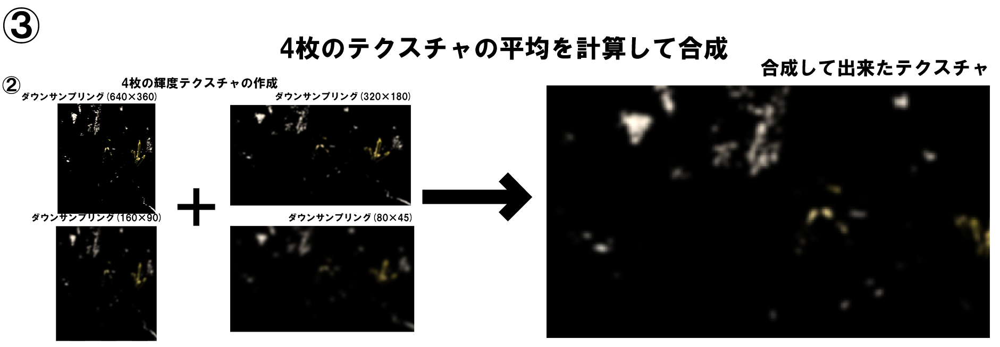
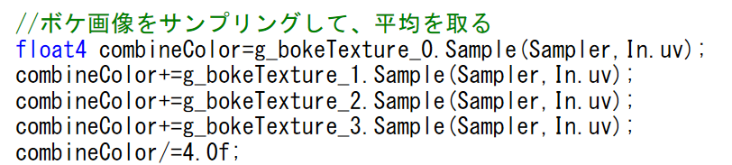
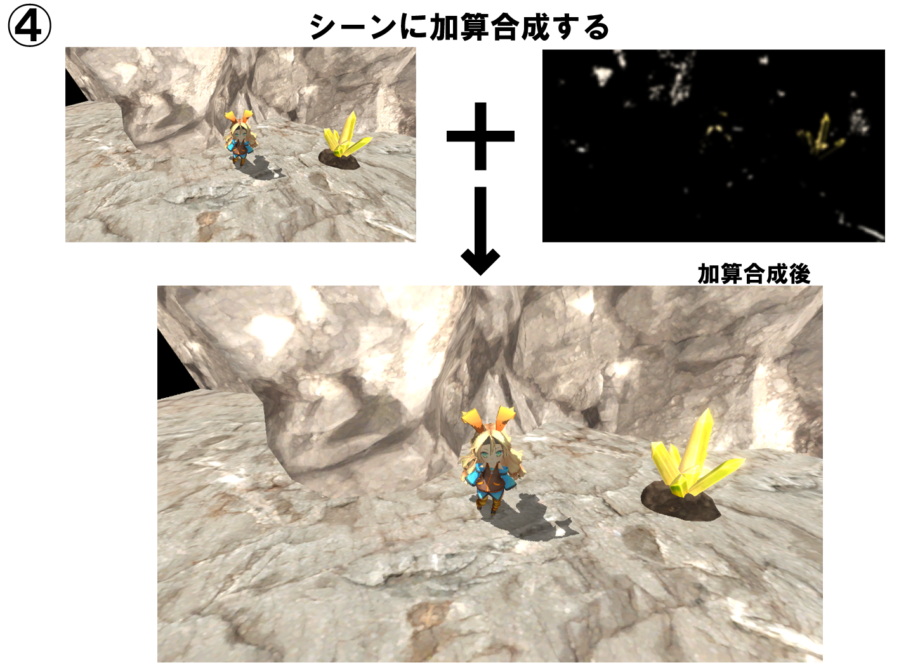

# Mining 

 

# **目次**

- [目次](#目次)
- [ゲーム概要](#ゲーム概要)
- [制作環境](#制作環境)
- [技術紹介](#技術紹介)
  - [川瀬式ブルーム](#川瀬式ブルーム)
  - [デプスシャドウ](#デプスシャドウ)
  - [ディファードライティング](#ディファードライティング)

 

# **ゲーム概要**
### ● 制作期間
### &emsp;2023年6月～
### ● 制作人数
### &emsp;3人
### ● ジャンル
### &emsp;ステルスゲーム
### ● プレイ人数
### &emsp;1人
### ● 対応ハード 
### &ensp;windows11
 

# **制作環境**
### ● 使用ツール
### &emsp;Visual Studio 2022
### &emsp;Visual Studio Code
### &emsp;3ds Max 2023
### &emsp;Adobe Photoshop 2022
### &emsp;fork
### &emsp;Github
### ● 使用言語
### &emsp;C++
### &emsp;HLSL

 
 

# **技術紹介**
## **川瀬式ブルーム**
### &emsp;実装目的として、高速で品質の高いブルームを表現することが出来るためです。
### &emsp;実装方法としては、通常のブルーム処理では、輝度テクスチャをぼかす処理を一回行います。しかしこの処理では、輝度テクスチャに複数のガウシアンブラーをかけていき、それらを加算合成するとで実装することが出来ます。
## **実装手順**
### ①　シーンをレンダリングして、輝度を抽出する。

### ②　①で抽出した輝度テクスチャに対してダウンサンプリングを４回行い、4枚のテクスチャを作成する

### ③　②で作成した４枚のテクスチャの平均を計算して合成する

### ④　シーンに③で求めたテクスチャを加算合成する

 

## **デプスシャドウ**
### &ensp;投影シャドウを実装するだけではモデルにシャドウマップを貼り付けているだけのため、上にオブジェクトがある場合にそこにも影が落ちてしまうという問題が発生しました。それを解決するために実装したのがデプスシャドウです。
### &ensp;デプスシャドウでは投影シャドウと違い、シャドウマップに書きこむ値がライトビュースクリーン空間での深度値を書き込みます。
### &emsp;そして、シャドウマップに書き込んだ値を使用しピクセルが遮断されているかを求めます。
 

## **ディファードライティング**
